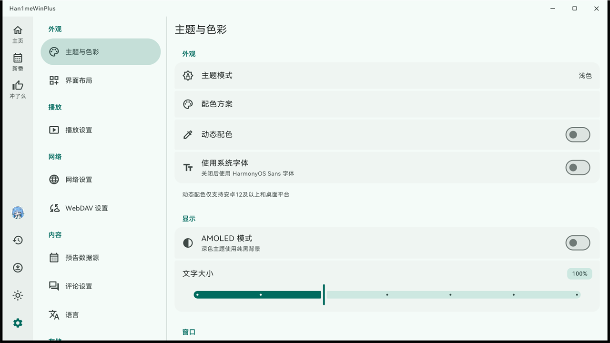
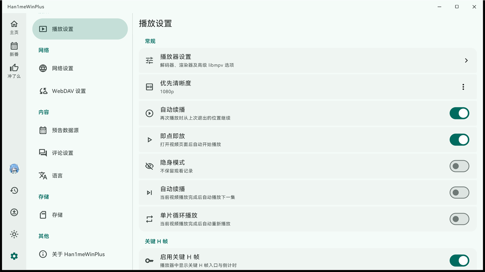
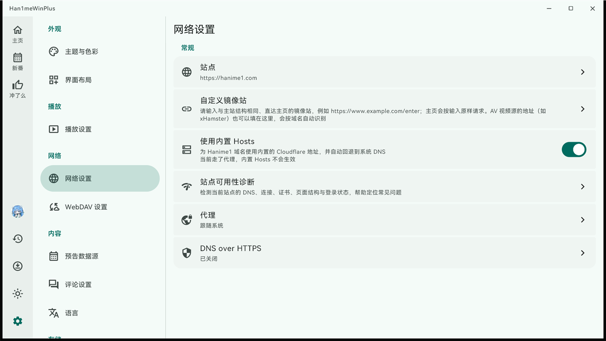
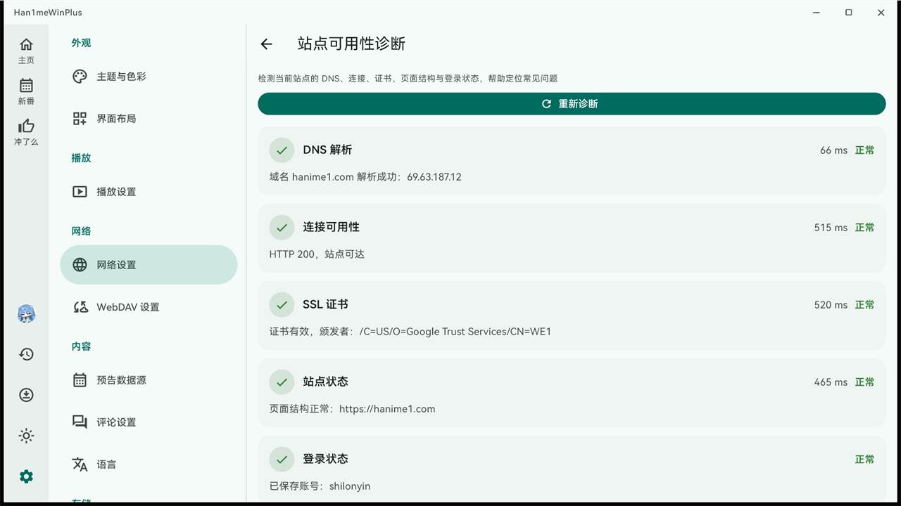

# Han1meWinPlus

<p align="center">
  <a href="README.en.md">English</a> · <b>简体中文</b>
</p>

<p align="center">
  
</p>

<p align="center">
  <b>专为 Windows 10 / 11 优化的 Hanime1 客户端</b><br>
  硬件解码 · 超分辨率 · 安装包 + 免安装版 · 内置自动更新<br>
  <sub>基于 Flutter 与 Material Design 3 构建 · Han1mePlus 的 Windows 专修分支</sub>
</p>

<p align="center">
  
  
  
</p>

<p align="center">
  <a href="https://github.com/shilonyin/Han1meWinPlus/actions/workflows/build-windows.yml"></a>
  <a href="https://github.com/shilonyin/Han1meWinPlus/releases/latest"></a>
  <a href="https://github.com/shilonyin/Han1meWinPlus/releases"></a>
  <a href="https://github.com/shilonyin/Han1meWinPlus/stargazers"></a>
</p>

<p align="center">
  <b>Windows 10 / 11 可直接下载安装使用</b><br>
  <a href="../../releases/latest">下载最新版</a> · <a href="../../issues/new/choose">提交反馈</a> · <a href="../../releases">更新日志</a> · <a href="../../discussions">讨论区</a>
</p>


## 简介

Han1meWinPlus 是 [Han1mePlus](https://github.com/1wc10086/Han1mePlus) 的 **Windows 专修分支（fork）**，基于 Flutter 开发，采用 Material Design 3 设计规范。

本分支只维护 Windows 平台，专注于 Windows 端的窗口、播放器、安装包与更新流程。`android` / `ios` / `macos` / `linux` 目录仅保留上游代码以便同步上游改动，不在本分支的维护范围内，也不保证可用。

> 本项目与 Hanime1 官方无任何关联，为社区维护的第三方开源客户端。

## 功能

- **Windows 专属**：原生窗口与自绘标题栏、窗口 / 全屏切换、多显示器与高 DPI 适配、安装包 + 免安装版、应用内自动更新（可走镜像）
- **播放器**：libmpv + 硬件解码（d3d11va / dxva2 / nvdec）+ 多档超分辨率（Anime4K、EWA Lanczos）+ 关键帧跳转、缓冲区间显示、播放进度记忆
- **网络**：内置直连地址、站点诊断（DNS / 连接 / 证书 / 页面结构 / 登录）、延迟探测自动选优、系统代理 / 直连 / 自定义代理、自定义镜像站
- **浏览与搜索**：首页分区、分类与标签筛选、多条件排序、搜索建议与搜索历史
- **本地库**：稍后观看、喜欢的影片、播放清单、观看历史、离线下载、追番订阅
- **界面**：Material Design 3、动态取色、浅色 / 深色 / AMOLED、内置 HarmonyOS Sans、界面语言 中（简 / 繁）/ 英

## 应用截图

| 首页（分区浏览） | 搜索结果 |
| --- | --- |
|  |  |

| 我的（稍后观看 / 收藏 / 播放清单 / 订阅） | 新番预告 |
| --- | --- |
|  |  |

| 外观设置 | 播放设置 |
| --- | --- |
|  |  |

| 网络设置 | 站点可用性诊断 |
| --- | --- |
|  |  |

> 截图中的影片封面与账号信息均已做模糊处理。

## 与上游的关系

**Windows 用户请直接用本仓库** —— 上游不维护 Windows 专属优化，Windows 端的窗口、播放器、安装包与更新流程都在这里。

- 上游仓库：[1wc10086/Han1mePlus](https://github.com/1wc10086/Han1mePlus)（AGPL-3.0）
- 本仓库为其派生作品，同样遵循 AGPL v3.0
- 同步上游：`git fetch upstream && git merge upstream/main`
- 上游通用问题请反馈到上游仓库；仅 Windows 相关的问题请提到本仓库的 Issue

| 项目 | [Han1mePlus](https://github.com/1wc10086/Han1mePlus) | Han1meWinPlus（本仓库） |
| --- | --- | --- |
| 定位 | 上游多平台项目 | Windows 专修分支（fork） |
| 维护平台 | Android 等移动端 | 仅 Windows 10 / 11 |
| Windows 窗口与标题栏 | 通用实现 | 专门适配（自绘标题栏、全屏窗口、DPI 缩放） |
| Windows 播放器 | 通用实现 | 专门适配（硬件解码档位、超分辨率、代理透传给播放器） |
| Windows 安装包 | 视上游情况 | 每次发版提供安装包与免安装包 |
| Windows 更新流程 | 通用 | 专门适配（应用内检查更新 + 镜像回退） |

Android 等其他平台请使用上游项目。

## 下载

### 推荐：安装版

**[Han1meWinPlus-Setup.exe](../../releases/latest)** —— 带开始菜单快捷方式，可正常卸载（[直接下载](../../releases/latest/download/Han1meWinPlus-Setup.exe)）

免安装版：`Han1meWinPlus-windows-x64.zip` —— 解压即用，运行 `han1me_win_plus.exe`（[直接下载](../../releases/latest/download/Han1meWinPlus-windows-x64.zip)）

> 首次运行出现「未知发布者」是正常现象（安装包未做代码签名），点「更多信息 → 仍要运行」即可；免安装版不经过安装流程，不会被拦。

- **系统要求**：Windows 10（1809 及以上）/ Windows 11，64 位
- **校验下载**：同版本提供 `SHA256SUMS.txt`（内容也附在 Release 说明里），可在 PowerShell 里用 `certutil -hashfile <文件名> SHA256` 核对
- **数据目录**：`%APPDATA%\han1me_win_plus\`，覆盖安装或升级不会丢失，卸载时也不会自动删除（需要清理请手动删除该目录）
- **升级**：已经在用旧版本时，应用内会自动提示更新，也可以在 设置 → 关于 里手动检查

全部历史版本与更新日志见 [Releases](../../releases) 页面。

## 项目状态

- **Windows**：维护中，功能持续完善
- **Android / iOS / macOS / Linux**：不维护，目录仅保留上游代码以便同步上游改动

已知限制（写在前面，避免误预期）：

- 安装包未做代码签名，首次运行会有 SmartScreen / 「未知发布者」提示
- 仅维护 Windows，其他平台不保证可编译或可用
- 部分站点图片 CDN 较慢，首屏封面可能需要等待，之后会走本地缓存
- 未提供自动化测试覆盖全部功能，仓库内目前只有更新检查相关的单元测试

## 常见问题

<details>
<summary>首次运行提示「未知发布者」或被杀毒软件拦截？</summary>

安装包未做代码签名（个人项目不购买签名证书），这是未签名程序的正常提示。点「更多信息」→「仍要运行」即可，也可以直接下载免安装版解压运行。

</details>

<details>
<summary>应用内检查更新失败或很慢？</summary>

更新检查走 GitHub Releases，网络受限时可能超时。设置 → 关于 里的「自动使用更新镜像」会在直连失败时依次尝试镜像地址；也可以直接到本仓库的 Releases 页面手动下载安装。

</details>

<details>
<summary>为什么不用上游项目？</summary>

本仓库是上游的 Windows 专修分支：上游的改动会同步进来，但窗口、播放器、安装包与更新流程都针对 Windows 单独维护，并且每次发版都提供可直接安装的产物。详见上方「与上游的关系」。

</details>

<details>
<summary>卸载会删掉我的数据吗？更新后数据还在吗？</summary>

不会。数据都在 `%APPDATA%\han1me_win_plus\`（账号、追番、观看历史、收藏、播放清单），覆盖安装与升级都不会动它，卸载也不会删除；需要彻底清理请手动删除该目录。

</details>

<details>
<summary>硬件解码不生效、播放花屏或黑屏？</summary>

设置 → 播放设置 里有「硬件解码」开关与「硬件解码器」选项，默认是 `auto-safe`。遇到花屏 / 绿屏 / 黑屏可以这样试：

1. 把「硬件解码器」换成 `d3d11va-copy` 或 `dxva2-copy`（copy 模式兼容性更好，代价是多一次内存拷贝）
2. 仍然异常就关掉「硬件解码」改用软解（更吃 CPU，但兼容性最好）

如果某个解码器在你的显卡上明显更稳，欢迎回来报一下显卡型号与驱动版本。

</details>

<details>
<summary>怎么设置代理或镜像站？</summary>

都在 设置 → 网络设置 里：

- **代理**：跟随系统 / 直连 / 自定义地址（`host:port`）。保存后界面请求与播放器（libmpv）会使用同一套代理
- **站点**：切换视频源站点，弹层底部的「站点分组」可以自定义分组名称与排序
- **自定义镜像站**：填入镜像地址后可点「测试连接」验证是否能正常解析

</details>

<details>
<summary>窗口拉窄后左侧栏消失、界面变成手机式布局？</summary>

这是预期行为：窗口最短边小于 600 逻辑像素时会自动切到紧凑布局，侧栏收进抽屉，把窗口拉宽即恢复。
若出现窗口位置错位、退出全屏后没还原，请先升级到最新版（最近修复过这类问题）；仍异常请带截图提 Issue。

</details>

## 从源码构建

> **必须使用 Flutter ≥ 3.47.0**（`m3e_core: ^1.1.1` 的约束），`.fvmrc` 已锁定为 `3.47.4`，建议使用相同版本构建。Flutter 版本偏低时 `flutter pub get` 会直接解析失败，与业务代码无关。

```bash
flutter pub get
flutter build windows --release
```

打包 Windows 安装程序（需先安装 [Inno Setup](https://jrsoftware.org/isinfo.php)）：

```bash
iscc /DMyAppVersion=1.1.21 windows/installer.iss
```

> `/DMyAppVersion=` 用于把版本号写进安装包，省略时会用 `installer.iss` 里的内置默认值，建议总是显式传入（CI 就是这么做的）。

## 发布新版本

发布由 GitHub Actions 自动完成（[`.github/workflows/build-windows.yml`](.github/workflows/build-windows.yml)），不需要本地打包。

1. 更新 `pubspec.yaml` 里的 `version:`（例如 `1.1.9+20`），提交并推送到 `win` 分支
2. 打 tag 并推送，tag 必须和 `pubspec.yaml` 的版本号一致：

   ```bash
   git tag v1.1.9
   git push origin v1.1.9
   ```

3. Actions 会用 `.fvmrc` 锁定的 Flutter 版本编译，再用 Inno Setup 打包，最后把 `Han1meWinPlus-Setup.exe`、`Han1meWinPlus-windows-x64.zip` 与 `SHA256SUMS.txt` 发到 Releases，并按 `feat` / `fix` 等前缀自动生成分类更新日志

> [!IMPORTANT]
> tag 必须是 `v` + 数字版本开头（`v1.1.9`、`v1.1.9-win.1` 都可以）。应用内「检查更新」只解析 tag 的前三段数字，写成 `win-v1.1.9` 会被当成 `0.0.0`，永远检测不到更新。tag 与 `pubspec.yaml` 版本不一致时 CI 会直接失败，避免发出对不上号的包。

> [!NOTE]
> 安装包未做代码签名，Windows 首次运行可能提示「未知发布者」，属正常现象。

## 如何贡献

本项目目前由个人维护。欢迎提 Issue 和功能建议，代码贡献请先阅读 [CONTRIBUTING.md](CONTRIBUTING.md)。

> [!TIP]
> **在 Issue 中提交建议**： 随时欢迎分享你的想法！

> [!NOTE]
> **分享想法与建议**： 如果你觉得缺少某个功能，或者有什么有意思的想法，欢迎随时新建一个 Issue。

> [!WARNING]
> **反馈 Bug**： 遇到了应用崩溃或运行异常？请创建一个 Issue 并尽可能提供详细信息，以便我排查和解决问题。

- **功能建议 / 使用问题**：新建 [Issue](../../issues/new/choose) 或到 [Discussions](../../discussions) 聊聊
- **Bug 反馈**：附上系统版本与应用版本（设置 → 关于）、复现步骤与截图，能大幅提高定位效率
- 与 Windows 无关的通用问题请提到[上游仓库](https://github.com/1wc10086/Han1mePlus/issues)

## 开源协议

本项目遵循 [AGPL v3.0](LICENSE) 协议，使用者必须严格遵守该协议的相关条款。

本仓库是 [Han1mePlus](https://github.com/1wc10086/Han1mePlus) 的修改版本：依据 AGPL-3.0 保留原作者署名、公开全部修改后的源代码，且不提供任何额外授权。分发本仓库（含编译后的二进制）时必须一并提供对应源码。

本应用为非官方客户端。使用者须自负合规审查责任，确保自身行为符合所访问平台的服务条款及适用法律。

本应用仅供年满 18 周岁的成年人使用。

本项目按“现状（As-Is）”提供，开发者不保证程序运行的连续性、稳定性或安全性。开发者不对因使用本项目而导致的任何形式的损失、损害、账号异常或法律纠纷承担任何法律责任。下载、安装或运行本项目即视为您已阅读、理解并完全同意本免责声明的所有条款。

## 鸣谢

[Han1mePlus](https://github.com/1wc10086/Han1mePlus)

本分支的上游项目，Windows 专修分支的全部基础代码均来源于此。

[Han1meViewer](https://github.com/misaka10032w/Han1meViewer)

一个优秀的开源项目，为本项目提供了参考与灵感。

如果这个项目对你有帮助，欢迎点亮 Star ⭐

遇到问题、想提建议或者想聊聊用法，欢迎到 [Issues](../../issues/new/choose) 与 [Discussions](../../discussions) —— 明确的 Bug 报告和可复现的步骤最有帮助。想提交代码请看 [CONTRIBUTING.md](CONTRIBUTING.md)。
